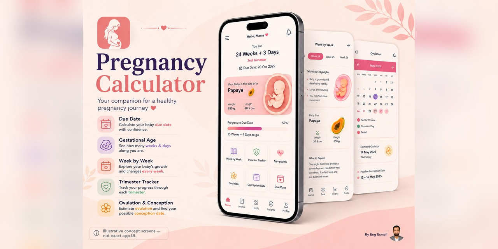

# Pregnancy Calculator (HamilGuide)

HamilGuide is a Flutter mobile app for Arabic-speaking pregnancy users. It helps calculate pregnancy progress, estimate the expected delivery date, and show the current pregnancy week using either Gregorian or Hijri dates.

The app also includes week-by-week pregnancy guidance, local saved pregnancy data, scheduled weekly notifications, an embedded HamilGuide website tab, social links, app rating prompts, and mobile ad integration.
